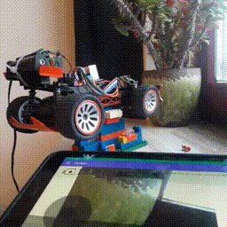
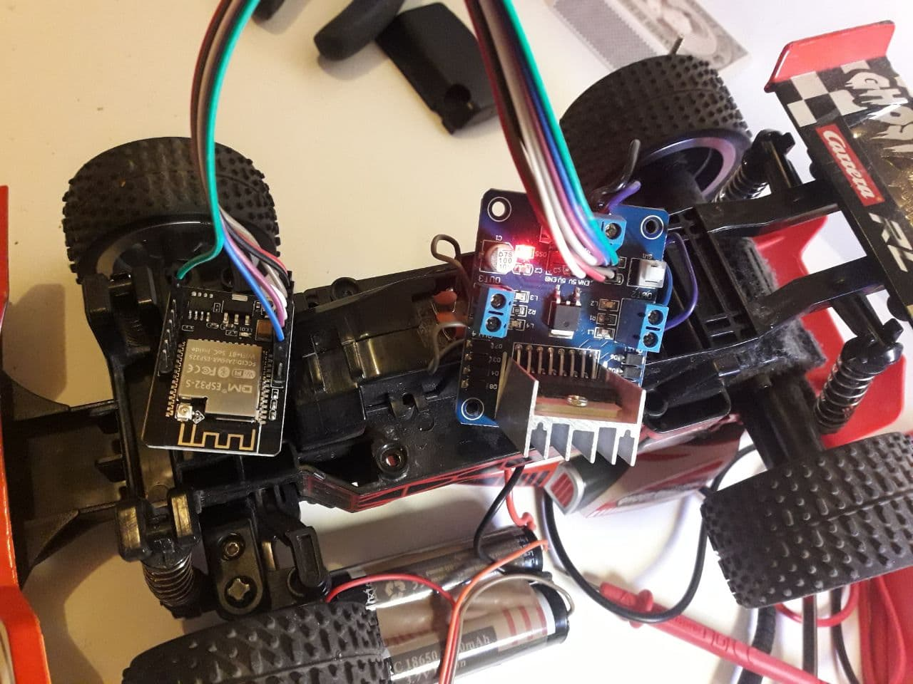
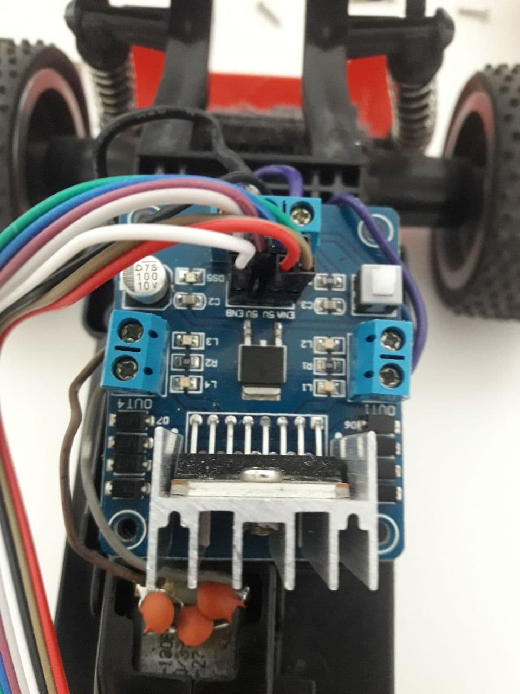

# Retrofit RC car

TL;DR

I retrofit an old RC car with ESP32-CAM module and wrote an  
<a href="https://github.com/rnauber/ESPHomeRC">Open Source Android app  ESPHomeRC</a> to control it via WiFi.  


|   |   |   | 
|---|---|---|
| [<br> click for higher quality video](media/testrig.mp4)  |   |   [<br> click for higher quality video](media/drive.mp4)|  


## The Hardware
### Bill of Materials
besides an old RC car stripped of the electronics you need:

* an ESP32-CAM module like [this](https://www.amazon.de/gp/product/B08BL6VG76/ref=ppx_yo_dt_b_asin_title_o01_s01?ie=UTF8&psc=1)
~15 Euro

* H-bridge module (based on [L298](https://www.st.com/resource/en/datasheet/l298.pdf)) like [this](https://www.amazon.de/DollaTek-Controller-Board-Modul-verdoppeln-Smart-Auto-Roboter/dp/B07DK6Q8F9/ref=pd_sbs_3?pd_rd_w=YfmdQ&pf_rd_p=c47a53d1-d94f-481c-a018-dcea8bd5c736&pf_rd_r=19XZHN6QXJM3M1M12XJW&pd_rd_r=7e4fbca7-6231-4c72-b9dd-0d53c0ab2fb4&pd_rd_wg=XVdYy&pd_rd_i=B07DK6Q8F9&psc=1)
~5 Euro
* two Li-Ion 18650 batteries like [these](https://www.amazon.de/kraftmax-Pack-18650er-Akku-Schutzschaltung/dp/B08PL1HRBQ/ref=sr_1_3?__mk_de_DE=%C3%85M%C3%85%C5%BD%C3%95%C3%91) and a holder ~25 Euro

so the total cost should be below 50 Euro

### The Assembly

|   |   |   | 
|---|---|---|
|  |  |


|ESP Pin |              | 
|--------|--------------|
|GPIO3 / VOR  | hbridge_in1 |
|GPIO2     | hbridge_in2 |
|GPIO14   | hbridge_in3 |
|GPIO15   | hbridge_in4 |
|GPIO12   | hbridge_en1 |
|GPIO13   | hbridge_en2 |

## The Firmware
[The firmware](firmware/rccar.yaml) is completely open and easily hackable. 
It is based on <a href="https://esphome.io/"></a>. You just describe your setup in a yaml file and a firmware will be generated.

### Preparation
<a href="https://esphome.io/guides/getting_started_command_line.html#installation">Install  </a>

### Build  and upload

```
esphome rccar.yaml run 
```

## The software

<a href="https://github.com/rnauber/ESPHomeRC">Open Source Android app  ESPHomeRC</a>


